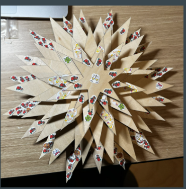
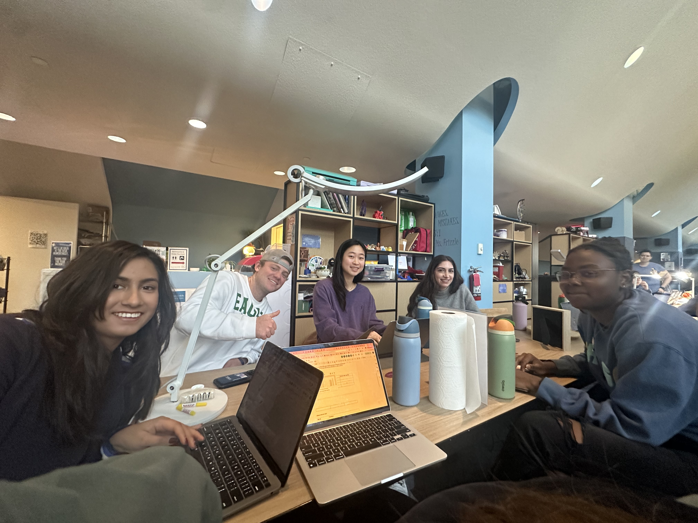

# ECReflection

&emsp;My group’s project was an in-depth exploration of holiday experiences within Eastern State Penitentiary in 1916. It was interesting to take everything we had learned and discussed and put it into practice via a digital humanities project. Through the process of transforming historical data into a tangible, three-dimensional representation of prisoner life, I've gained a deeper understanding of ESP and how creative expression helps people empathize with others even from over a hundred years ago.\
&emsp;Our project’s goal was to help others connect with the prisoners, and in the process, I could connect with the data on a more human level. I found myself imagining the individuals behind the numbers – the prisoners who experienced Christmas, Thanksgiving, and New Year's within the confines of Eastern State, which I think was correlated to starting this project around Thanksgiving. I found it interesting how Christmas in particular was discussed in the months before December. It made me wonder about what emotions these holidays evoked in them. Did they offer a brief reprieve from the monotony of prison life, a flicker of hope in the face of confinement?  Did they stir up memories of a life outside those walls, of families and traditions lost? The process of humanizing the data brought a new perspective to my understanding of the past and how we could bring what seemed like a simple spreadsheet to life. I think that we did a great job accomplishing our goal in creating a holiday themed vertical timeline of the year 1916 where we showed the number of times holidays were mentioned throughout the year in the Umpire. I believe that every member of our group contributed in a meaningful way and we were able to accomplish our goal. Had we been given more time, I think we could have made it more detailed, instead of using stickers for ornaments we could have put laser holes in the tree and crafted ornaments. I think that our mistake was being over-ambitious in the beginning not leaving ourselves enough time to pivot when we discovered the initial problems in our plan, such as the time it takes to cut wood because it needs to be at a lower temperature so it does not burn, or that the ornaments were unrealistic given the number of holidays we had identified and our time constraints. I also think we could have made a table where we accounted for how many times each holiday was discussed in each month next to the tree to give a tangible idea of how many ornaments there were, but we did not have the time to consider whether or not this would be worthwhile or detract from our fabrication. \
\
Our Final Product.\
&emsp;My role within the group was the project manager. I was focused on making sure all members of the team were on track, especially in the week between when we figured out our project and before we came into the EC to work on it. I made sure that the Google sheet and doc were up to date and that we pulled the best year from the Umpire for our project. I also worked on some parts of the project, specifically figuring out our specific queries for the Python script with Sukya, cutting the ornament stickers with the fabrication team, and working on the slide show with Nick and Kristin. I believe the group worked well together because everyone respected one another’s strengths and abilities and were supportive and happy to learn from each other. I also think that everyone in my group was respectful of the prisoners and were passionate about creating the best product that would help people empathize with the prisoners at ESP as we had come to feel throughout the course. There is nothing I would want to change about our project or process and was happy with our process or outcome. \
\
Our group.\
&emsp;The most significant takeaway from this project has been the realization of how art and technology can intertwine to foster empathy and understanding.  The tree, with its layers of ornaments, became a bridge between the present and the past, inviting viewers to step into the world of Eastern State in 1916 and connect with the experiences of those who lived within its walls. For me, it showed in practice the power of digital humanities to illuminate the past in new and engaging ways.  By combining historical research with creative expression and digital tools, we were able to not only learn more about ESP’s history but also connect with it on a deeper, more meaningful level.\
&emsp;Beyond a deeper appreciation for digital humanities, it's been an incredible lesson in teamwork and collaboration, where each of us brought our unique strengths to the table, ultimately creating something far greater than we could have achieved individually. For example, I was initially sifting through the prison records, identifying and categorizing each mention of holiday celebrations.  Then Sukya stepped in with a Python script that automated the entire process in a matter of minutes.  Witnessing the power of her skills and the efficiency it brought to our project was a true "aha" moment. Similarly, when it came to designing and fabricating the ornaments, Nicole and Hannah's prior experience with laser cutting and design proved invaluable.  Watching them navigate the software, troubleshoot technical challenges, and bring their artistic visions to life was inspiring.  I learned so much from their expertise, not just about the technical aspects of laser cutting, the creative process, and the importance of precision and attention to detail.\
