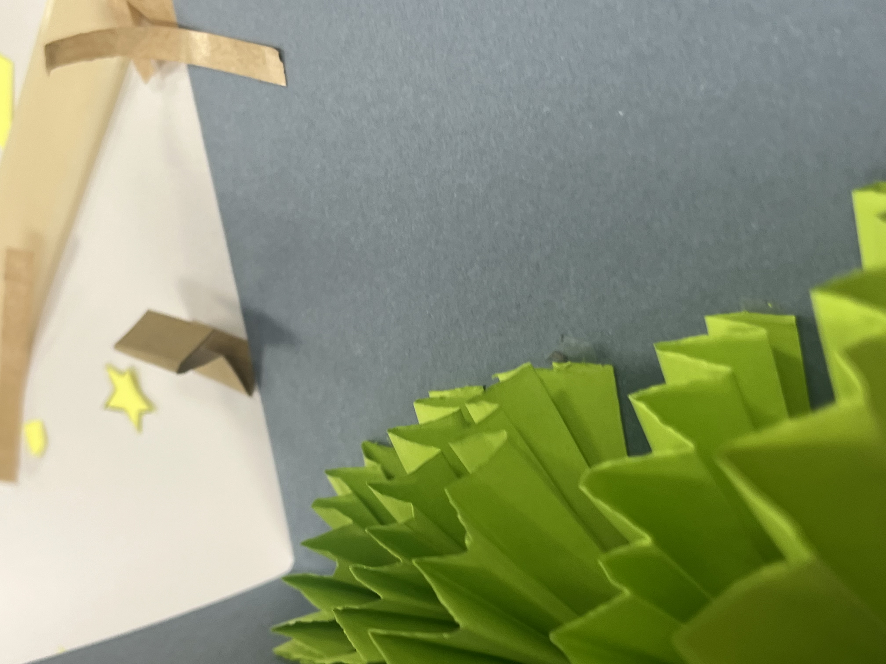
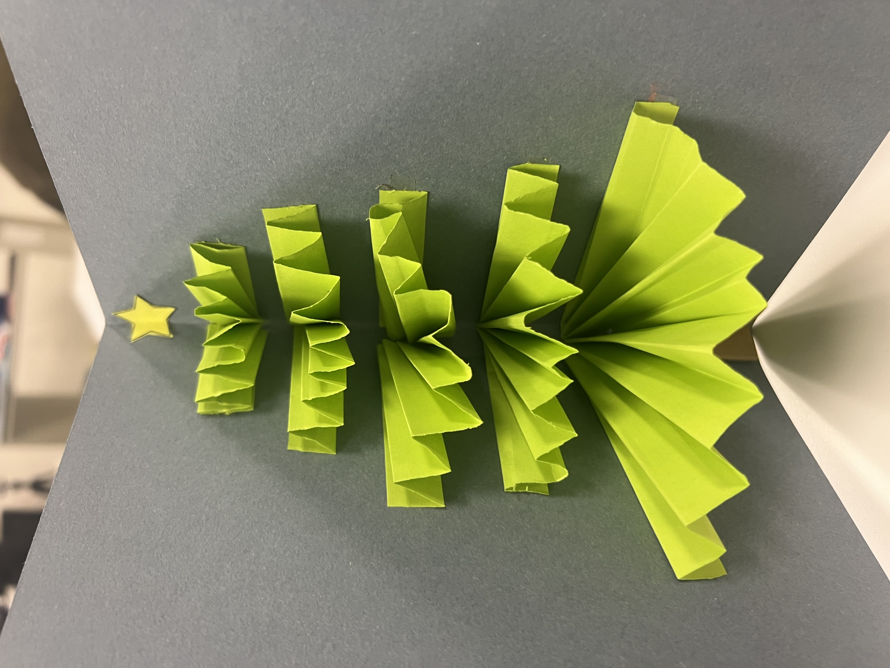

## Rutgers ERA OF GENERATIVE AI Symposium

I was the most interest in attending the Rutgers ERA OF GENERATIVE AI Symposium, as I have a friend at Rutgers who do work with the Crticial AI initiative and watched the videos online as I was unable to attend in person. The first-panel discussion, titled "Information Seeking and Walled Gardens", was one of my favorite presentations as it was a thoughtful analysis of the changing landscape of information access and retrieval in the digital age. The panelists, Leslie Allison and Tiffany DeRewal from Rowan University, presented a compelling argument about the potential impact of generative AI on information seeking behavior.    

Allison and DeRewal began by contrasting traditional search engines, such as Google, with the emerging generative search engines. They highlighted how traditional search engines have provided the perception of limitless information at our fingertips, but the rise of search engine optimization, ad revenue, and social media has led to a decline in the quality of search results.  This decline, and with the public's demand for alternative information-seeking experiences, has paved the way for generative search engines. The panelists noted that while these new engines offer advantages such as curation, synthesis, multimodal interaction, and speed, Furthermore they talked about the concept of "walled gardens" of generative search engines, where information may be curated and synthesized in ways that obscure the original sources, highlighted the need for more transparent regulations with these new technologies  This analysis was in line with the emphasis in our Digital Humanities class on the importance of digital literacy, particularly in evaluating the credibility and authority of online information.   

In the next panel, I really enjoyed  Kerry McAuliffe’s presentation which was a fascinating exploration of computational culture, memory, and historical narratives. She explored the concept of AI’s "unreasonable authority" and how tools like ChatGPT perform an authoritative voice, despite being probabilistic and often unreliable. She emphasized the challenges of verifying AI-generated information, as shown in her interaction with ChatGPT, which produced confidently fabricated historical sources. McAuliffe’s work highlights the tension between technology as a source of knowledge and its potential to mislead. This presentation resonated with my own experiences of skepticism toward AI. It underscored the importance of critical thinking when engaging with AI-generated content. I was particularly struck by her framing of ChatGPT as a "propositional" tool that presents claims to be evaluated rather than accepted outright. This idea aligns with the need to teach students how to interrogate information sources critically, a skill that feels more urgent in the age of generative AI. Her emphasis on the constructed nature of objectivity also connects to discussions in class about the biases inherent in archival records that we explored with our prison write ups.

I was amazed by Amml Hussein's presentation on how she uses AI and expressive arts to aid trauma healing among justice-impacted youth. Through healing circles and AI-generated visualizations, the participants are encouraged to explore their post-trauma identity and imagine future possibilities. Hussein emphasized the importance of providing safe, non-verbal avenues for expressing trauma and how these methods could help youth build confidence and develop entrepreneurial aspirations. The presentation opened my eyes to how AI can be applied in deeply human and therapeutic ways. Her use of AI for trauma healing challenges the notion that technology is impersonal or detached from emotional experiences. I was particularly moved by the stories of youth visualizing their futures through AI-generated art, as it showed how technology can be a tool for hope and agency. This connects to our class discussions on how tools can either perpetuate or dismantle inequities, depending on how they are used. Her work is the most powerful example of technology as a force for empowerment and source of good, I have seen in the AI space. 

Lastly, I enjoyed John Burmeister, an assistant professor of philosophy at Mount St. Vincent, presentation on how large language models could complement human creativity and reasoning. Burmeister introduced the metaphor of the Centaur, a hybrid of human intellect and AI’s computational power to create a collaborative model that leverages each of their strengths. He described LLMs as "possibility machines," capable of rapidly producing diverse ideas, not as tools for generating definitive answers. For example, he described how LLMs could be used to propose various hypotheses in scientific or philosophical research. Particularly I found his example of using AI to generate new lines of inquiry in understanding neurological conditions like autism very intriguing. The idea that AI could serve as a brainstorming partner, offering directions that might otherwise go unexplored, is an interesting way of thinking about AI’s role in education and research that could be productive. Additionally, he argued that training AI systems on high-quality, domain-specific data could significantly improve their usefulness in fields like philosophy, mathematics, or literature. For example, he imagined an AI trained exclusively on philosophical texts, which could then assist scholars in comparing thinkers like Descartes and Socrates with greater nuance and accuracy than a generalist model like ChatGPT. While I found this idea promising, it also prompted me to reflect on potential drawbacks. Would such specialization limit interdisciplinary insights by narrowing the scope of the AI’s training?	
The workshop reinforced the central themes of our class, specifically the need for critical engagement with digital tools, an awareness of their limitations and biases, and the potential for using them to empower others. It also highlighted that technology, in its design, implementation, and application reflects the values and priorities of those who create and deploy it. This is especially relevant in the context of the digital humanities, where AI can either amplify existing inequities or serve as a powerful agent for uncovering hidden narratives.

As we navigate the evolving landscape of AI and digital technologies, the insights from this workshop will continue to shape how I approach the digital humanities and am an intentional participant in this new AI age. It also means striving to ensure that the work I do with digital tools contributes to broader goals of equity and keeping in mind the importance of academic honesty, sourcing transparently, and not further perpetuating biases fueled by AI. 

## Penn Workshop: 
I attended the pop-up card workshop at the Kislak Center where we made a holiday Christmas card. The workshop was an incredible reminder of how something creative, like making cards, can bring people together. It was interesting to meet people from different walks of life. There were students like me, but also elderly members of the community, and even a librarian’s mother-in-law. Everyone was focused on their cards, but we were also chatting and helping each other out. It made me realize that even though we were all different, we had something in common. We were all there to learn something new and make something unique. It reminded me of what we talked about in class – how books and art can create communities and help people connect. I loved how welcoming the workshop was. You didn't need to be an artist or creatively gifted to participate. They gave us all the materials and showed us exactly what to do. It made me think about how important it is for everyone to have a chance to be creative, no matter what their background, age, or ability
\
\
My Card.\

The workshop was a nice break from reading and lectures, and it helped me understand our class material in a new way. Making the pop-up card made me think about the design of books that we had seen earlier in the Kislak Center, specifically the popup obstetrics book. It gave me a true appreciation for how much precision, dedication, and patience it took to construct that book. 

I also realized that books can be a way for people to express themselves. We were all making the same basic card, but everyone's turned out a little different and was made for different people in their lives.  Some people added extra decorations, such as creating a sparkling star and others made their pop-ups really complicated by adding thinner and differently shaped according flaps to create the pop up. It showed me how books and art can be a way for people to share their ideas and personalities. Overall, the pop-up card workshop was a really cool experience that I would highly recommend to others. It was fun to make something with my hands, and it helped me connect what we're learning in class with the real world. 

Leaving the workshop, I felt a renewed sense of appreciation for the artistry and craftsmanship embedded in every book. It inspired me to want to seek more experiences like this where I interact with different parts of the Penn communities and reconnect with the creative part of me. As I carefully cut and folded the paper, I was reminded of my childhood when I would spend hours making handmade cards for my family and friends. This workshop rekindled the childhood joy of creating something tangible and meaningful. It reminded me of the simple pleasure of working with my hands, transforming ordinary materials into something beautiful and expressive. The act of creating brought a sense of calm and focus that was a welcome break from the demands of academic life. I am going to actively seek out more creative outlets, whether it's attending workshops, joining art clubs, or simply dedicating time to personal artistic projects.

\
\
Finished Card.\

